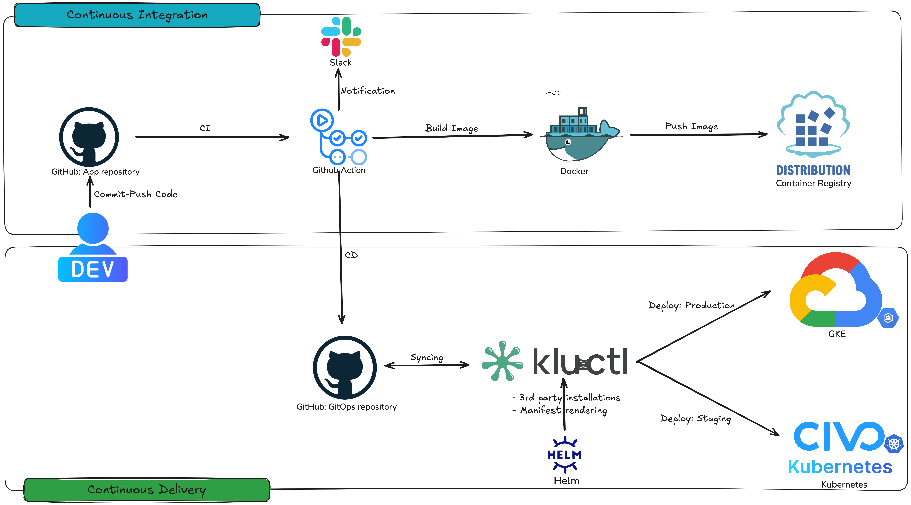

# **Web Application Deployment to Kubernetes**

This repository demonstrates a project where I designed and implemented the deployment of a simple web application to Kubernetes clusters using modern DevOps tools and GitOps principles. The project covers the complete CI/CD pipeline from building and testing container images to deploying on both **Google Kubernetes Engine (GKE)** (production) and **Civo Kubernetes** (staging).

---

## **Project Overview**

This project involves:
- Building and deploying a web application composed of the following microservices:
  - **API-Golang**: Backend written in Go.
  - **API-Node**: Backend written in Node.js.
  - **Client-React**: Frontend React application.
  - **Load-Generator**: Python-based load testing service.
  - **PostgreSQL**: Database for application data.
- Deployments were automated using GitHub Actions, Traefik Ingress, and Kluctl GitOps.

---

## **Technologies and Tools Used**

- **Containerization**: Docker for building multi-arch container images.
- **CI/CD Pipelines**: GitHub Actions for automating build, test, and deployment processes.
- **GitOps**: Kluctl for managing Kubernetes manifests and deployments.
- **Orchestration**: Kubernetes for running microservices, Traefik as an ingress controller.
- **Cloud Platforms**:
  - **Google Kubernetes Engine (GKE)** for production.
  - **Civo Kubernetes** for staging.
- **Development Tools**:
  - **Devbox & Nix** for dependency management.
  - **kubectl** and **kubectx** for Kubernetes configuration and context switching.

---

## **Key Features**

- **Microservices Architecture**:
  - Each service has a dedicated Kubernetes Deployment, Service, and ConfigMap/Secret.
  - Clear separation of concerns between staging and production environments.

- **Ingress Routing**:
  - Traefik was used to manage ingress routes for staging and production environments.
  - Custom IngressRoute configurations ensure seamless routing to the services.

- **Automated CI/CD Pipelines**:
  - CI pipelines build, tag, and push container images to Docker Hub using GitHub Actions.
  - CD pipelines deploy images to staging and production Kubernetes clusters using Kluctl.

- **GitOps Workflow**:
  - Declarative Kubernetes manifests are managed in the repository.
  - Environments are deployed by targeting specific configurations (e.g., `staging.yaml` or `production.yaml`).

---

## **Deployment Process**

### **Pipeline Overview**
1. **Build Stage**: GitHub Actions build container images, tag them semantically, and push them to Docker Hub.
2. **Staging Deployment**: Kluctl deploys the latest images to the Civo Kubernetes staging cluster.
3. **Production Deployment**: Upon approval, the pipeline deploys the tested changes to GKE for production.

### **Architecture**
```plaintext
GitHub Actions CI/CD Pipeline
├── Build Multi-arch Images (Docker)
├── Push to Docker Hub
├── Deploy to Staging (Civo Kubernetes)
├── Deploy to Production (Google Kubernetes Engine)
```



---

## **Repository Highlights**

- **Kubernetes Manifests**:
  - Located in the `deployment-env/kluctl/` directory.
  - Includes namespaces, ingress routes, and service configurations.
- **CI/CD Pipelines**:
  - Configured in `.github/workflows`.
  - Includes build, deploy, and update workflows.
- **Environment Configurations**:
  - Environment-specific variables and settings in `config/`.

---

## **Learnings and Impact**

Through this project, I achieved:
- Proficiency in GitOps workflows using Kluctl.
- Expertise in managing Kubernetes deployments in multi-cloud environments.
- Advanced automation of CI/CD processes using GitHub Actions.
- Deepened understanding of container orchestration, ingress management, and declarative infrastructure.

---

## **Why This Project?**

This project demonstrates my ability to:
- Architect scalable and efficient Kubernetes deployments.
- Automate complex CI/CD pipelines with modern DevOps tools.
- Apply GitOps principles for managing cloud-native applications.
- Deliver reliable and secure web applications in production.

---

Feel free to explore the repository and reach out with any questions!
